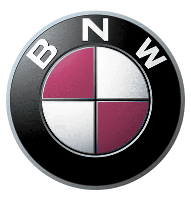

  

## 🎬 Project 소개
---
### 2022 Node.js 3 weeks project
 
영화, 애니메이션, 음악 등등을 리뷰하고 사용자들이 서로 소통하는 리뷰 커뮤니티 사이트 제작

 
 

### 👊 팀 BNW. 👊

| 이름   | 직책 | 소개                                   | Github                                                                                                                                                                                      |
| ------ | ---- | -------------------------------------- | ------------------------------------------------------------------------------------------------------------------------------------------------------------------------------------------- |
| 장재원 | 팀장 | 어제보다 더 나은 개발자가 되고 싶은 개발자 꿈나무 |  |
| 한빈 | 팀원 | 프론트면 프론트, 백이면 백 못하는 게 없는 풀스택 개발자            |     |
| 홍종남 | 팀원 | 포텐셜 최강자, 준비된 개발자 홍종남!!       |        |

 
 

## 🏁 Feature
---
 

- jwt 방식의 로컬 회원가입 및 로그인
- passport를 활용한 카카오 로그인 / 구글 로그인 / 네이버 로그인 
- 이미지, 해시태그 기능을 포함한 게시판 CRUD 및 댓글, 대댓글, 좋아요, 스크랩 기능 구현
- 제목, 내용, 해시태그를 활용한 게시글 검색 기능
- socket.io를 활용한 채팅방 기능
- 관리자 페이지 내 회원관리, 게시글관리, 게시판 카테고리 CRUD 기능

 
 

## 🔧 Tech Stack
---
 

 

---

